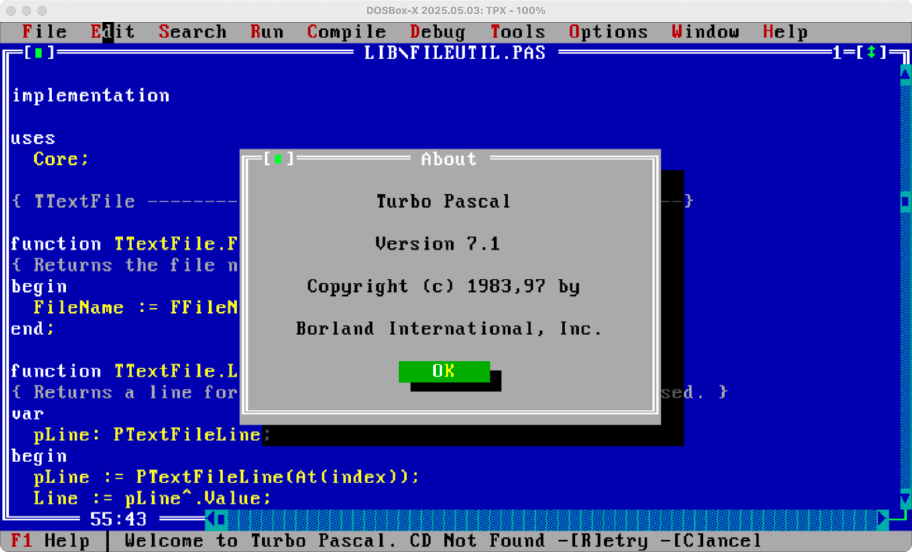

# Welcome

Back in the 1980s and early 1990s, [Borland](https://en.wikipedia.org/wiki/Borland) was our hero!  It published the 
tools most of us used in our daily work - programming.  I was privilaged to there in the early days, when the DOS 
prompt was what greeted you on turned on the PC.  You typed 'Turbo', 'TPX' or whatever to stard your environment and 
a day of puzzling was ahead of you.    

Now retired, this repository represents my journey back in time, in an attempt to relive the good old days and keep my 
brain ticking over.

# Turbo Pascal

Turbo Pascal was a software development system that included a compiler and an integrated development environment (IDE)
for the programming language Pascal running on the operating systems CP/M, CP/M-86, and MS-DOS. It was originally 
developed by Anders Hejlsberg at Borland, and was notable for its very fast compiling. 

## Version 5.5
This version, released on 2 May 1989,[39] introduced object-oriented programming features for the Pascal language, 
including concept of classes, static and dynamic objects, constructors and destructors and inheritance, which would 
become the basis for the Object Pascal found in Borland Delphi. The IDE uses the default blue colour scheme that would 
also be used on later Borland Turbo products. Other changes to IDE include the addition context-sensitive help with 
description of all built-in functions, and the ability to copy code fragments from the help to edit window.

## Version 6.0
Version 6 was released on 23 October 1990.[39] Changes from 5.5 include: the addition of inline assembly, the addition 
of the Turbo Vision library, mouse support, clipboard for text manipulations, multiple document interface supporting 
up to nine edit windows.

## Version 7.0
Version 7 was released on 27 October 1992.[39] Changes from 6.0 include support for the creation of DOS and Windows 
executables and Windows DLLs, and syntax highlighting.[43] For version 7 Borland released a professional version of 
Turbo Pascal, named Borland Pascal.

# Software Index

The 'software' folder contains copies of the compilers, debuggers, linkers, libraries and other tools I uss in coding 
with these old environments.

| File                | Description                                                   |
| ------------------- | ------------------------------------------------------------- |
| Turbo-Pascal-71.zip | Turbo Pascal version 7.1 - The final released for DOS in 1992 |

# Manuals Index

The 'manuals' folder contains all the reference material I make use of when working with these old development 
environments.

| File                        | Description                                             |
| --------------------------- | ------------------------------------------------------- |
| Turbo-Pascal-71-Manuals.zip | PDFs of the manuals for TP version 7 and Turbo Vision 2 |

# Videos

The 'videos' folder holds copies of videos I have posted on [my YouTube channel](https://www.youtube.com/@ObjectPascal).
