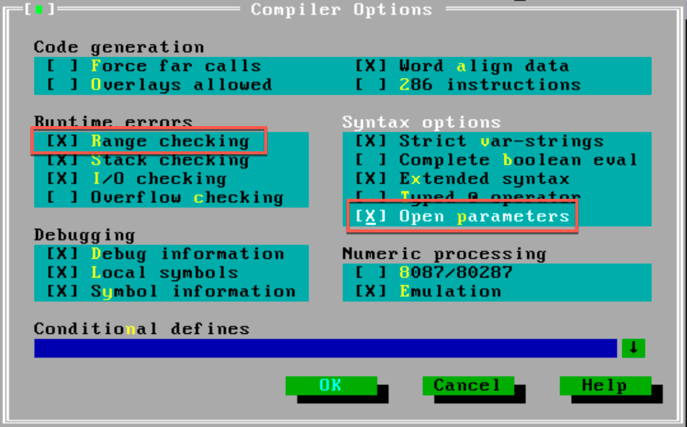
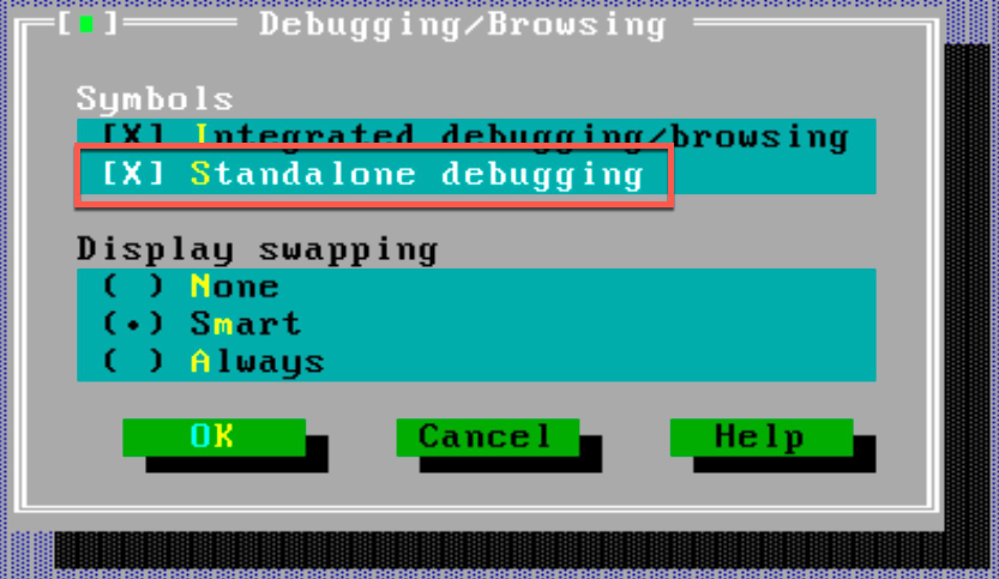
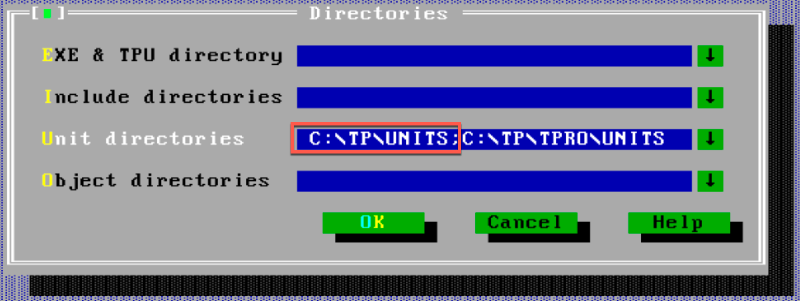
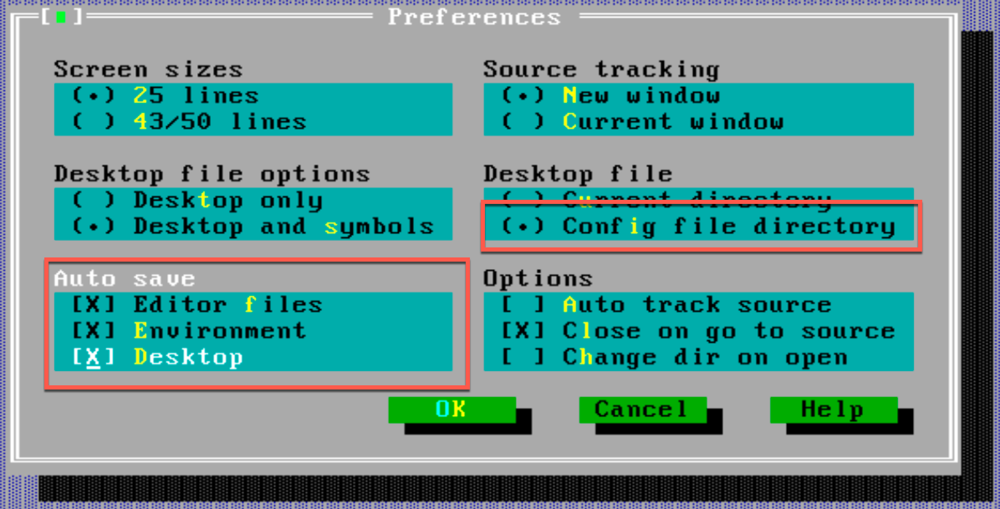
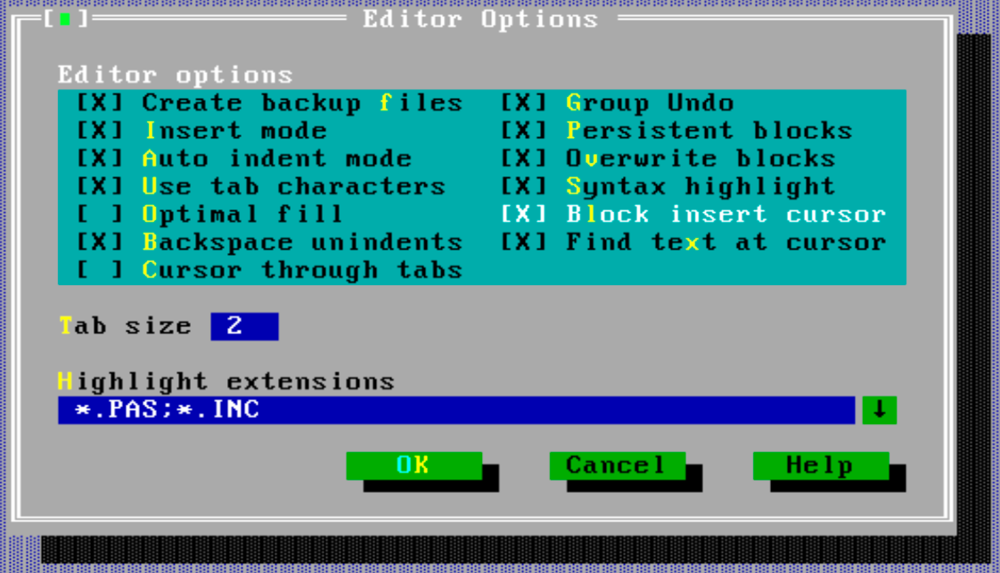
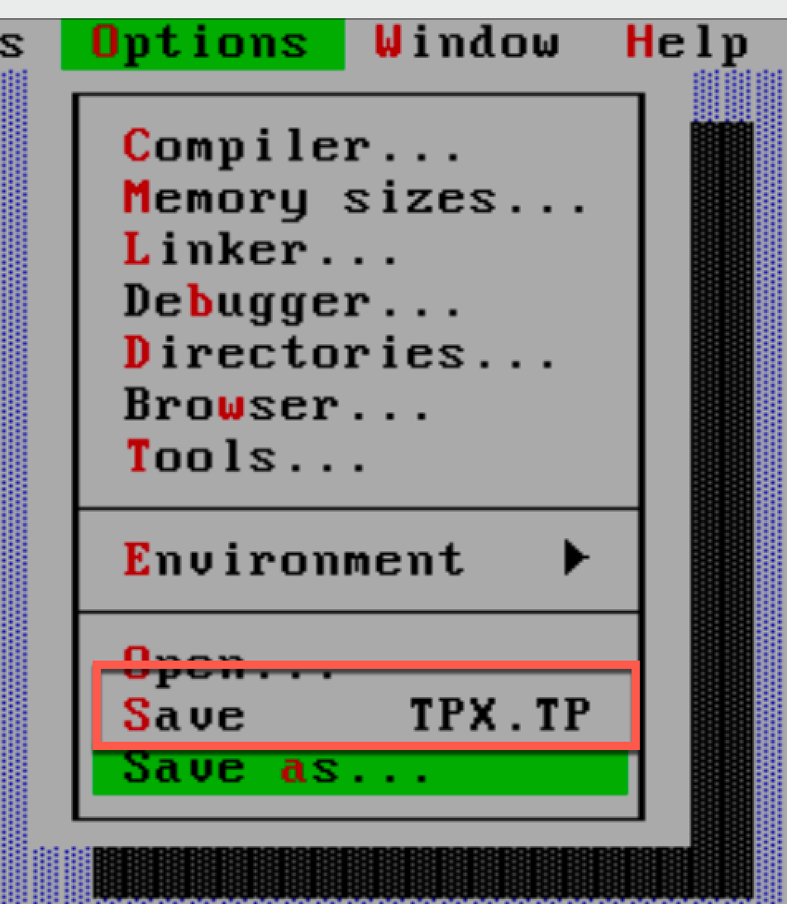

# IDE Configuration

## Introduction

This note sets out how I prefer to have the Turbo Pascal IDE configured.

## Compiler Options

Open parameters should be the default in Turbo Pascal 7.0 and range checking should be enabled
during development.

## Debugging

Standalone debugging should be enabled to all for the use of the Turbo Debugger, if desired.

## Directories

Specify as required for the progject, but note that the Turbo Pascal Units folder needs to be included.

## Preferences

This configuration saves the layout etc. to the project folder

## Editor

This configuration is as close as I could get in the IDE to match the behaviour of modern editors.

## Saving the options

By saving the selections to the project folder it is possible to have different configurations per project.

