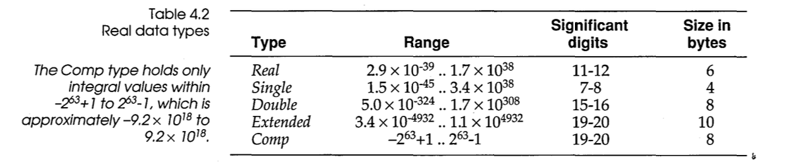

# Turbo Pascal Data Types

## Integer Types

| Name     | Range                    | Size    |
| -------- | ------------------------ | ------- |
| ShortInt |        -128..+128        | 1 Byte  |
| Integer  |      -32768..+32768      | 2 Bytes |
| LongInt  | -2147483648..+2147483648 | 4 Bytes |
| Byte     |           0..255         | 1 Byte  |
| Word     |           0..65335       | 2 Bytes |

## Real Types

## Standard Types

This section documents standard types define in the Turbo Pascal Units

| Name    | Unit | Underlying Type | Comments                   |
| ------- | ---- | --------------- | -------------------------- |
| ComStr  | DOS  | String[127]     | Command-Line string        |
| PathStr | DOS  | String[79]      | Full file path string      |
| DirStr  | DOS  | String[67]      | Dirve and directory string |
| NameStr | DOS  | String[8]       | File-name string           |
| ExtStr  | DOS  | String[4]       | File-extension string      |

In addition the WINDOS unit defines the following constants"

| Name        | Value |
| ----------- | ----- |
| fsPathName  |    79 |
| fsDirectory |    67 |
| fsFileName  |     8 |
| fsExtension |     4 |

                                       